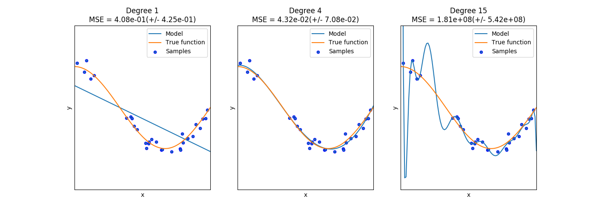
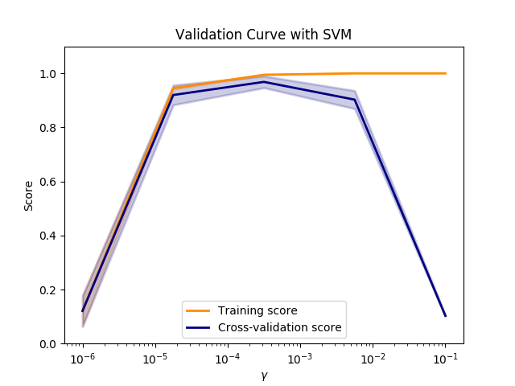
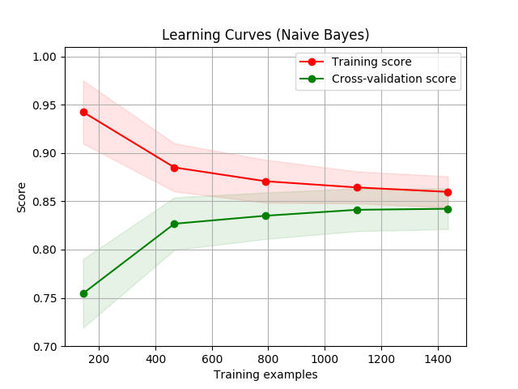
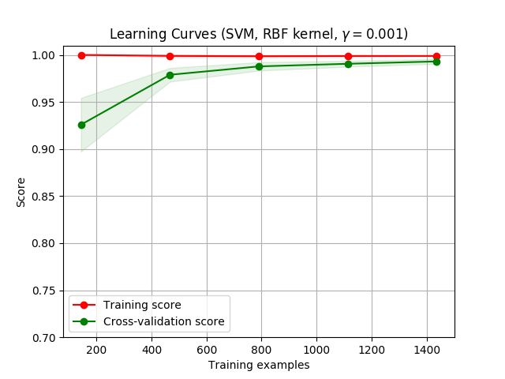

# 3.5\. 验证曲线: 绘制分数以评估模型

校验者:
        [@正版乔](https://github.com/apachecn/scikit-learn-doc-zh)
        [@正版乔](https://github.com/apachecn/scikit-learn-doc-zh)
        [@小瑶](https://github.com/apachecn/scikit-learn-doc-zh)
翻译者:
        [@Xi](https://github.com/apachecn/scikit-learn-doc-zh)

每种估计器都有其优势和缺陷。它的泛化误差可以用偏差、方差和噪声来分解。估计值的 [**](#id2)偏差**是不同训练集的平均误差。估计值的**方差**用来表示它对训练集的 变化有多敏感。噪声是数据的一个属性。

在下面的图中，我们可以看到一个函数 [:math:`f(x) = \cos (\frac{3}{2} \pi x)`_](#id4) 和这个函数的一些噪声样本。 我们用三个不同的估计来拟合函数： 多项式特征为1,4和15的线性回归。我们看到，第一个估计最多只能为样本和真正的函数提供一个很差的拟合 ，因为它太简单了(高偏差），第二个估计几乎完全近似，最后一个估计完全接近训练数据， 但不能很好地拟合真实的函数，即对训练数据的变化（高方差）非常敏感。

[](../auto_examples/model_selection/plot_underfitting_overfitting.html)

偏差和方差是估计所固有的属性，我们通常必须选择合适的学习算法和超参数，以使得偏差和 方差都尽可能的低（参见偏差-方差困境 [`Bias-variance dilemma&lt;https://en.wikipedia.org/wiki/Bias-variance_dilemma&gt;`_](#id10)）。 另一种降低方差的方法是使用更多的训练数据。不论如何，如果真实函数过于复杂并且不能用一个方 差较小的估计值来近似，则只能去收集更多的训练数据。

在一个简单的一维问题中，我们可以很容易看出估计值是否存在偏差或方差。然而，在高维空间中， 模型可能变得非常难以具象化。 出于这种原因，使用以下工具通常是有帮助的。

示例:

*   [Underfitting vs. Overfitting](../auto_examples/model_selection/plot_underfitting_overfitting.html#sphx-glr-auto-examples-model-selection-plot-underfitting-overfitting-py)
*   [Plotting Validation Curves](../auto_examples/model_selection/plot_validation_curve.html#sphx-glr-auto-examples-model-selection-plot-validation-curve-py)
*   [Plotting Learning Curves](../auto_examples/model_selection/plot_learning_curve.html#sphx-glr-auto-examples-model-selection-plot-learning-curve-py)

## 3.5.1\. 验证曲线

我们需要一个评分函数（参见模型评估：[模型评估: 量化预测的质量](model_evaluation.html#model-evaluation)）来验证一个模型， 例如分类器的准确性。 选择估计器的多个超参数的正确方法当然是网格搜索或类似方法 （参见调优估计的超参数 [调整估计器的超参数](grid_search.html#grid-search) ），其选择一个或多个验证集上的分数最高的超参数。 请注意，如果我们基于验证分数优化了超参数，则验证分数就有偏差了，并且不再是一个良好的泛化估计。 为了得到正确的泛化估计，我们必须在另一个测试集上计算得分。

然而，绘制单个超参数对训练分数和验证分数的影响，有时有助于发现该估计是否因为某些超参数的值 而出现过拟合或欠拟合。

本例中,下面的方程 [`validation_curve`](generated/sklearn.model_selection.validation_curve.html#sklearn.model_selection.validation_curve "sklearn.model_selection.validation_curve") 能起到如下作用:

```py
>>> import numpy as np
>>> from sklearn.model_selection import validation_curve
>>> from sklearn.datasets import load_iris
>>> from sklearn.linear_model import Ridge

```

```py
>>> np.random.seed(0)
>>> iris = load_iris()
>>> X, y = iris.data, iris.target
>>> indices = np.arange(y.shape[0])
>>> np.random.shuffle(indices)
>>> X, y = X[indices], y[indices]

```

```py
>>> train_scores, valid_scores = validation_curve(Ridge(), X, y, "alpha",
...                                               np.logspace(-7, 3, 3))
>>> train_scores
array([[ 0.94...,  0.92...,  0.92...],
 [ 0.94...,  0.92...,  0.92...],
 [ 0.47...,  0.45...,  0.42...]])
>>> valid_scores
array([[ 0.90...,  0.92...,  0.94...],
 [ 0.90...,  0.92...,  0.94...],
 [ 0.44...,  0.39...,  0.45...]])

```

如果训练得分和验证得分都很低，则估计器是不合适的。如果训练得分高，验证得分低，则估计器过拟合， 否则估计会拟合得很好。通常不可能有较低的训练得分和较高的验证得分。所有三种情况都可以 在下面的图中找到，其中我们改变了数字数据集上 SVM 的参数  。

[](../auto_examples/model_selection/plot_validation_curve.html)

## 3.5.2\. 学习曲线

学习曲线显示了对于不同数量的训练样本的估计器的验证和训练评分。它可以帮助我们发现从增加更多的训 练数据中能获益多少，以及估计是否受到更多来自方差误差或偏差误差的影响。如果在增加训练集大小时，验证分数和训练 分数都收敛到一个很低的值，那么我们将不会从更多的训练数据中获益。在下面的图中看到一个例子：朴素贝叶斯大致收敛到一个较低的分数。

[](../auto_examples/model_selection/plot_learning_curve.html)

我们可能需要使用评估器或者一个当前评估器的参数化形式来学习更复杂概念（例如有一个较低的偏差）。 如果训练样本的最大时，训练分数比验证分数得分大得多，那么增加训练样本很可能会增加泛化能力。 在下面的图中，可以看到支持向量机（SVM）可以从更多的训练样本中获益。

[](../auto_examples/model_selection/plot_learning_curve.html)

我们可以使用:func:[`](#id8)learning_curve`函数来绘制这样一个学习曲线所需的值（已使用的样本数量，训练集 上的平均分数和验证集上的平均分数）:

```py
>>> from sklearn.model_selection import learning_curve
>>> from sklearn.svm import SVC

>>> train_sizes, train_scores, valid_scores = learning_curve(
...     SVC(kernel='linear'), X, y, train_sizes=[50, 80, 110], cv=5)
>>> train_sizes
array([ 50, 80, 110])
>>> train_scores
array([[ 0.98...,  0.98 ,  0.98...,  0.98...,  0.98...],
 [ 0.98...,  1\.   ,  0.98...,  0.98...,  0.98...],
 [ 0.98...,  1\.   ,  0.98...,  0.98...,  0.99...]])
>>> valid_scores
array([[ 1\. ,  0.93...,  1\. ,  1\. ,  0.96...],
 [ 1\. ,  0.96...,  1\. ,  1\. ,  0.96...],
 [ 1\. ,  0.96...,  1\. ,  1\. ,  0.96...]])

```